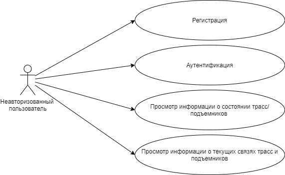
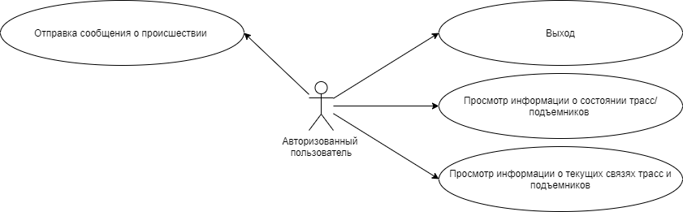
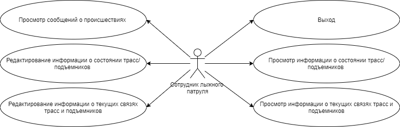
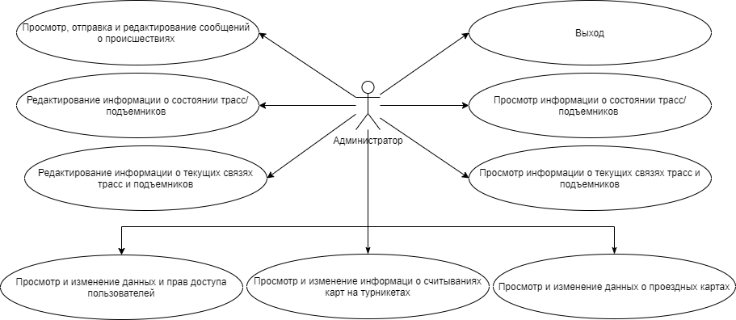
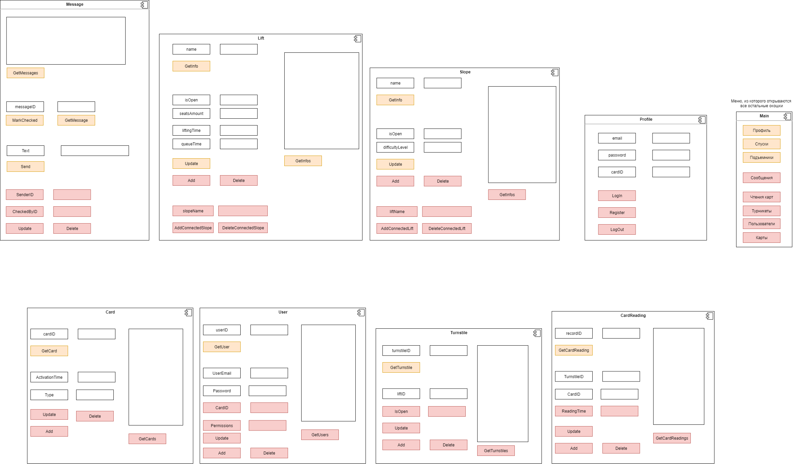
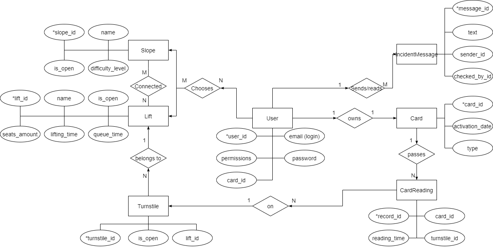

# Приложение для онлайн-мониторинга состояния объектов горнолыжного курорта.

## Цель работы

Разработать web-приложение, позволяющее в онлайн-режиме получать и редактировать информацию об объектах горнолыжного курорта.

## Краткий перечень функциональных требований.
Пользователь должен иметь возможность регистрации и аутентификации, отправлять сообщения о происшествиях и просматривать информацию об объектах горнолыжного курорта:

- загруженность подъемников (время в очереди);
- открытость/закрытость трасс и подъемников;
- до каких трасс можно добраться на определенном подъемнике / на каких подъемниках можно добраться до определенной трассы (в дальнейшем для краткости эта информация будет обозначаться как "связь трасс и подъемников");
- сообщения о неполадках на трассах/подъемниках/турникетах подъемников.

## Use-Case - диаграммы.

Виды пользователей:
1. Неавторизованный пользователь

2. Авторизованный пользователь

3. Сотрудник лыжного патруля

4. Администратор

## Экраны будущего приложения на уровне черновых эскизов.

## ER-диаграмма сущностей системы

